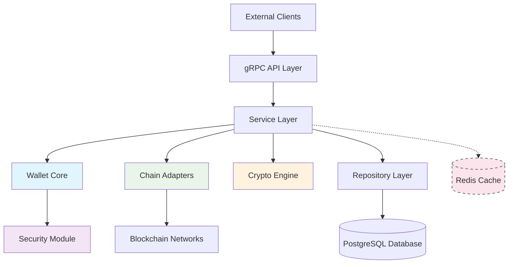
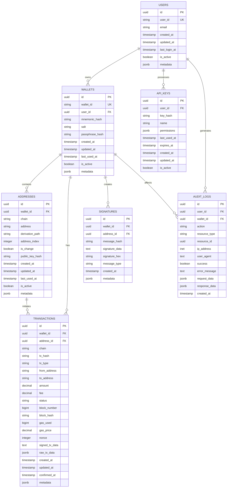
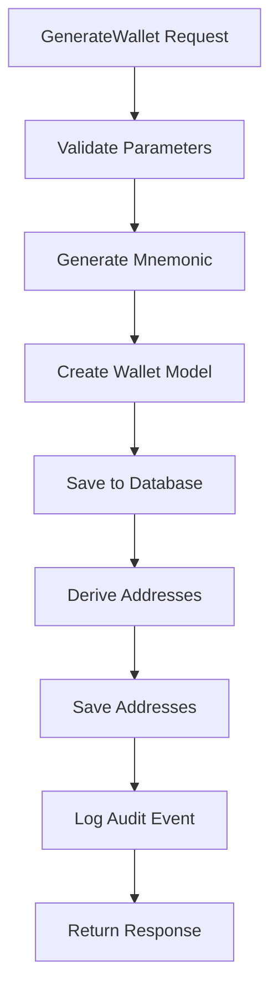
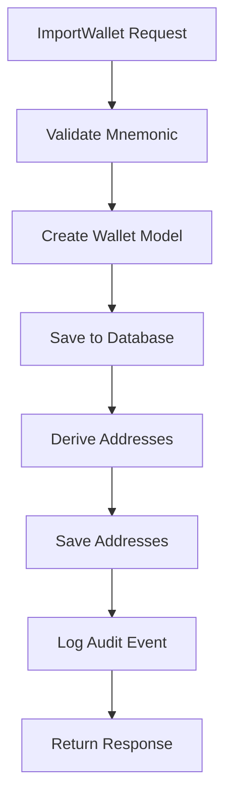
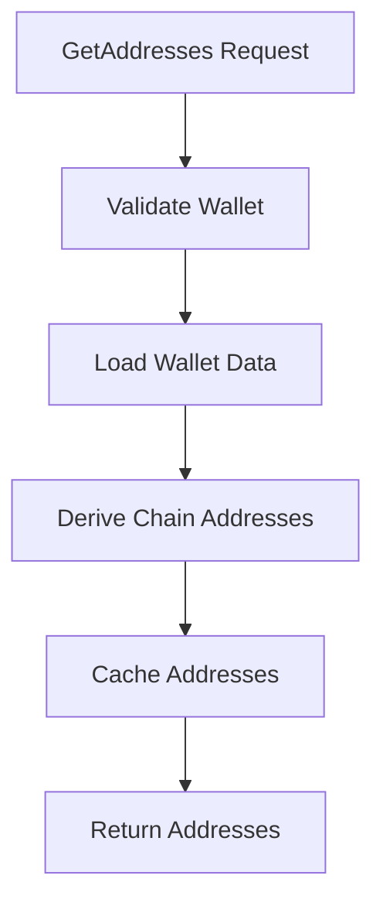
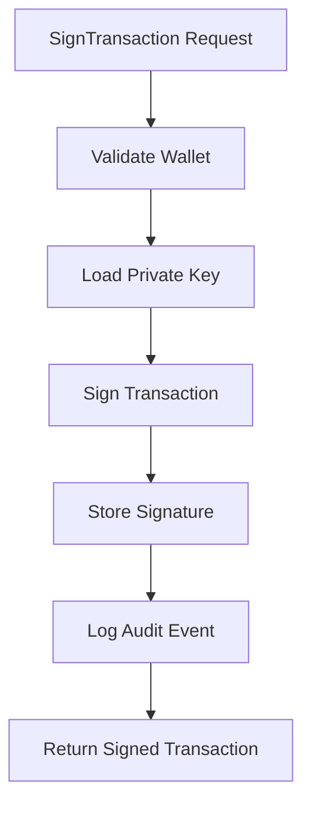
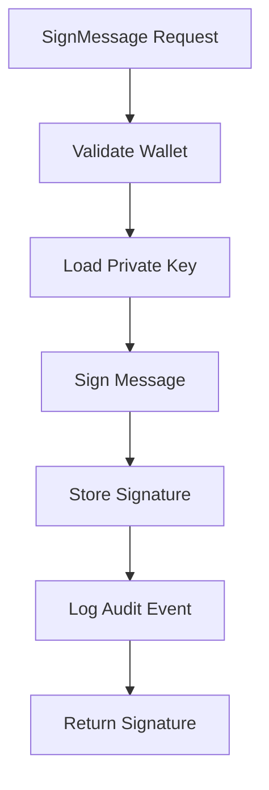
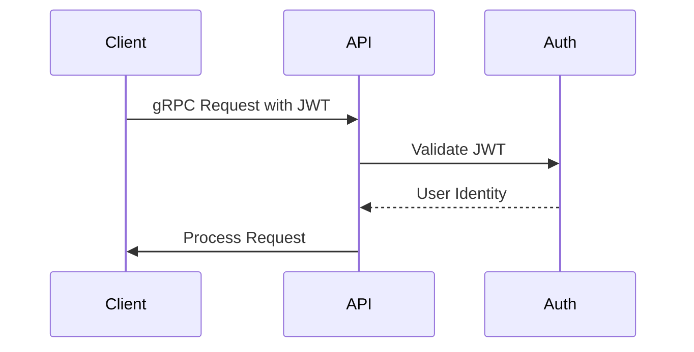

# Phillet Wallet Core Development Design Document

## 1. Overview

### 1.1 Purpose
This document outlines the design of the Phillet Wallet Core, a secure, multi-chain HD wallet management service that provides cryptographic operations, key management, and blockchain interaction capabilities for the Phillet ecosystem.

### 1.2 Scope
The service handles:
- HD wallet generation and import from mnemonic phrases
- Multi-chain address derivation (Ethereum, Polygon, BSC, Solana, TON)
- Transaction signing and message signing
- Signature verification
- Balance querying
- Wallet metadata management

### 1.3 Key Features
- Multi-chain support with extensible architecture
- Secure key management with in-memory storage
- gRPC API for service-to-service communication
- Comprehensive audit logging and monitoring
- High-performance operations with caching

## 2. Architecture

### 2.1 System Architecture
The Phillet Wallet Core follows a layered architecture pattern with clear separation of concerns:



### 2.2 Component Description

| Component | Responsibility |
|-----------|----------------|
| **gRPC API Layer** | Exposes wallet operations through protocol buffers |
| **Service Layer** | Orchestrates business logic and coordinates between components |
| **Wallet Core** | Manages HD wallet operations and key derivation |
| **Chain Adapters** | Implements blockchain-specific functionality |
| **Crypto Engine** | Handles cryptographic operations and signing |
| **Security Module** | Manages key storage, encryption, and access control |
| **Repository Layer** | Manages data persistence and retrieval |

## 3. API Endpoints Reference

### 3.1 Service Definition
The service implements the following gRPC methods:

| Method | Description |
|--------|-------------|
| `GenerateWallet` | Creates a new HD wallet with mnemonic phrase |
| `ImportWallet` | Imports an existing wallet from mnemonic phrase |
| `GetAddresses` | Returns addresses for specified chains |
| `SignTransaction` | Signs a transaction for specified chain |
| `SignMessage` | Signs a message with wallet's private key |
| `VerifySignature` | Verifies a digital signature |
| `GetBalance` | Returns balance for specified address |
| `GetWalletInfo` | Returns wallet information |

### 3.2 Request/Response Schema

#### GenerateWallet
```protobuf
message GenerateWalletRequest {
  string user_id = 1;
  repeated Chain chains = 2;
  int32 word_count = 3; // 12, 15, 18, 21, 24
  string passphrase = 4; // Optional passphrase for additional security
}

message GenerateWalletResponse {
  string wallet_id = 1;
  string mnemonic = 2;
  repeated Address addresses = 3;
  google.protobuf.Timestamp created_at = 4;
}
```

#### ImportWallet
```protobuf
message ImportWalletRequest {
  string user_id = 1;
  string mnemonic = 2;
  string passphrase = 3; // Optional passphrase
  repeated Chain chains = 4;
}

message ImportWalletResponse {
  string wallet_id = 1;
  repeated Address addresses = 2;
  google.protobuf.Timestamp imported_at = 3;
}
```

### 3.3 Authentication Requirements
All API endpoints require JWT-based authentication passed through gRPC metadata with the format:
```
authorization: Bearer <jwt_token>
```

## 4. Data Models & ORM Mapping

### 4.1 Database Schema



### 4.2 ORM Mapping
The system uses direct database queries rather than an ORM, with the following model mappings:

| Database Table | Go Struct |
|----------------|-----------|
| `users` | `models.User` |
| `wallets` | `models.Wallet` |
| `addresses` | `models.Address` |
| `transactions` | `models.Transaction` |
| `signatures` | `models.Signature` |
| `api_keys` | `models.APIKey` |
| `audit_logs` | `models.AuditLog` |

## 5. Business Logic Layer

### 5.1 Wallet Management

#### 5.1.1 Wallet Generation Process


#### 5.1.2 Wallet Import Process


### 5.2 Address Management

#### 5.2.1 Address Derivation Workflow


### 5.3 Cryptographic Operations

#### 5.3.1 Transaction Signing Process


#### 5.3.2 Message Signing Process


### 5.4 Security Implementation

#### 5.4.1 Key Management Strategy
- Private keys are generated on-demand and never persisted
- Mnemonic phrases are hashed before storage
- All sensitive data is encrypted at rest
- Secure memory handling to prevent key leakage

Note: Based on the current implementation, private keys are managed in-memory only and never stored persistently. Mnemonic phrases are stored as hashes with associated salts for security.

#### 5.4.2 Authentication Flow


## 6. Middleware & Interceptors

### 6.1 Authentication Middleware
- Extracts and validates JWT tokens from gRPC metadata
- Associates requests with user identities
- Enforces access control policies

### 6.2 Logging Middleware
- Captures all API requests and responses
- Records performance metrics
- Logs security-relevant events

### 6.3 Error Handling Middleware
- Standardizes error responses across the API
- Maps internal errors to appropriate gRPC status codes
- Ensures sensitive information is not exposed in error messages

## 7. Testing Strategy

### 7.1 Unit Testing
- Target: 90%+ code coverage
- Focus on cryptographic functions and business logic
- Mock external dependencies (blockchain networks, databases)
- Test error conditions and edge cases

### 7.2 Integration Testing
- End-to-end wallet operations
- Multi-chain transaction signing
- Database integration tests
- Cache behavior validation

### 7.3 Security Testing
- Penetration testing for API endpoints
- Cryptographic implementation validation
- Side-channel attack resistance
- Fuzzing for input validation

## 8. Performance & Scalability

### 8.1 Caching Strategy
- Address caching for frequently accessed wallets
- Balance caching with TTL expiration

### 8.2 Database Optimization
- Connection pooling for efficient database access
- Indexing strategies for common query patterns

### 8.3 Horizontal Scaling
- Stateless service design for easy load balancing
- Shared-nothing architecture where possible

## 9. Security Considerations

### 9.1 Threat Model
- Private Key Exposure: Mitigated by in-memory-only storage
- Mnemonic Theft: Mitigated by encryption at rest
- Replay Attacks: Mitigated by nonce validation
- Man-in-the-Middle: Mitigated by TLS/mTLS
- Denial of Service: Mitigated by rate limiting

### 9.2 Security Controls
- Input sanitization and validation
- Secure random number generation
- Memory protection and clearing
- Audit logging and monitoring
- Regular security assessments

## 10. Monitoring and Observability

### 10.1 Metrics Collection
- Request rate and response times
- Error rates by type and endpoint
- Wallet creation and usage statistics
- Resource utilization (CPU, memory, disk)
- Blockchain network connectivity status

### 10.2 Logging Strategy
- Structured logging (JSON format)
- Security event logging
- Performance metrics logging
- Error tracking and alerting
- Audit trail for sensitive operations

### 10.3 Health Checks
- Service health endpoint
- Database connectivity check
- Blockchain RPC availability
- Cache system status
- Memory and CPU usage monitoring